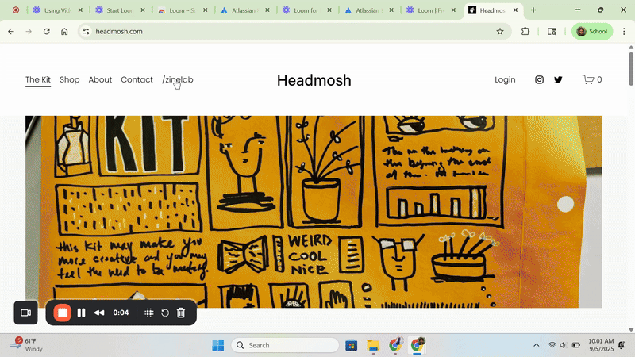

# 📰 Headmosh Zine Lab  

**Permission to Create — right in your browser.**  
Turn one sheet of paper into an 8-page mini-zine. Drag, drop, scribble, remix, export, print, fold. Done.  

✨ *From glitch to zine, from scraps to sparks — this is Headmosh.*  

---

  
  
  

---

## 🎥 Demo  

  
*Zine Lab in action — paste, drag, shuffle, export.*  

---

## 📖 Example Zine  

  
*Example: “Datamosh → Headmosh” mini-zine made in the lab. Print, fold, cut → booklet in your hands.*  

---

## ✨ Features  

- **8 editable panels** — type, paste, or drag images directly in.  
- **Asset Library** — bold black-and-white doodles & prompts built-in.  
- **Shuffle** — remix panel order instantly.  
- **Save/Load JSON** — persist and restore projects.  
- **Export PNG** — snapshot of the current workspace.  
- **Zine Layout → Print** — automatic imposition to front/back sheet.  
  - Order: **Front:** 8 • 1 • 2 • 7 — **Back:** 6 • 3 • 4 • 5  
- **Print-and-fold mini-zine** — literally from screen to your hands in minutes.  

---

## 🚀 Quickstart  

1. **Open:** [Launch Zine Lab](https://hand3seen.github.io/Headmosh-MINI_ZINE/)  
2. **Drop art:** Type into any panel, paste screenshots, or use the Asset Library.  
3. **Remix:** Shuffle panels, drag new assets, add scribbles.  
4. **Print:** Click *Zine Layout → Print* and fold into a booklet.  

💡 *Pro tip: screenshot your sketchbook, paste it in, export, and you’ve got a zine in under 5 minutes.*  

---

## 🌐 Deploy on GitHub Pages  

1. Create a new repo (e.g., `headmosh-zine-site`).  
2. Add `index.html` (this project is a single self-contained file).  
3. Go to **Settings → Pages** → choose *Deploy from a branch → main → /root*.  
4. Open the Pages URL → you’re live.  

---

## 🖊️ Using the Editor  

- **Select a panel:** click it (highlighted outline).  
- **Add assets:** drag from the Asset Library or press *Add random object*.  
- **Paste images:** copy any image → ⌘/Ctrl+V inside a panel.  
- **Shuffle:** mixes panel positions (visual only).  
- **Export PNG:** saves the current 8-panel grid.  
- **Save/Load JSON:** version your zine, restore anytime.  

---

## 🖨️ How to Print & Fold  

Goal: **one US Letter sheet → 8-page booklet.**  

1. **Print** your zine export on **US Letter (or A4)**.  
   - Scale = **100%** (no “fit to page”).  
2. **Fold in half long-ways** (hot dog style).  
3. **Unfold**, then fold **short-ways** (hamburger style).  
4. Fold **short-ways again** → you now have 8 mini-pages stacked.  
5. **Cut** along the center crease (just the middle fold).  
6. Refold into a booklet → the slit opens and collapses into 8 pages.  

Step 1: Print full sheet
┌─────────────┐
│ 8 panels │
│ on sheet │
└─────────────┘

Step 2: Fold long-ways
┌─────────────┐
│ │
│ ─────→ │
│ │
└─────────────┘

Step 3: Fold short-ways twice
┌─────┐
│ │
│ │
└─────┘

Step 4: Cut center slit
┌─────┐
│ ─ │ (cut middle crease only)
└─────┘

Step 5: Refold into booklet
📖 → 🎉 Mini-zine!

---

## 📚 Documentation
- [Getting Started](docs/getting-started.md)
- [Printing Guide](docs/printing-guide.md)
- [Features](docs/features.md)
- [Tips & Tricks](docs/tips-and-tricks.md)
- [FAQ](docs/faq.md)
- [Changelog](docs/changelog.md)

---

## 💡 Why Headmosh?  

Datamosh makes glitches into art. **Headmosh** makes half-thoughts, scraps, and overlaps into culture.  
The Zine Lab is your **permission slip to create** — raw, imperfect, fast.  

**Head first into the mosh.**  

---

## 📜 License  

MIT — free to use, remix, share.  
